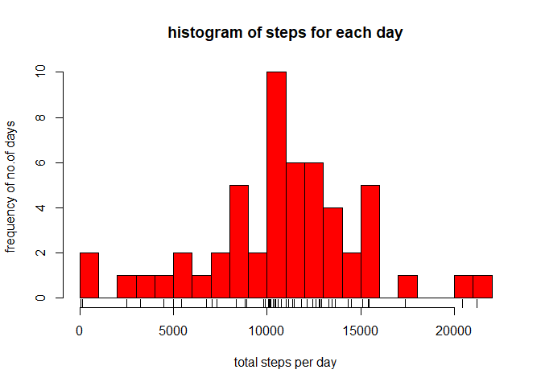
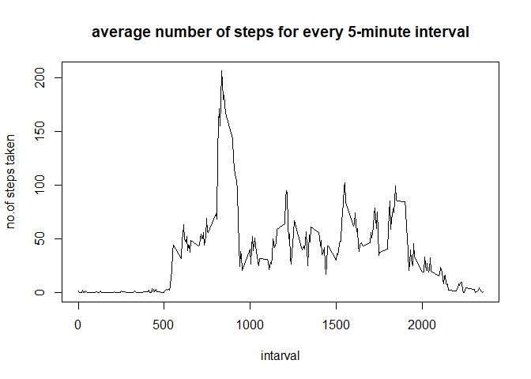
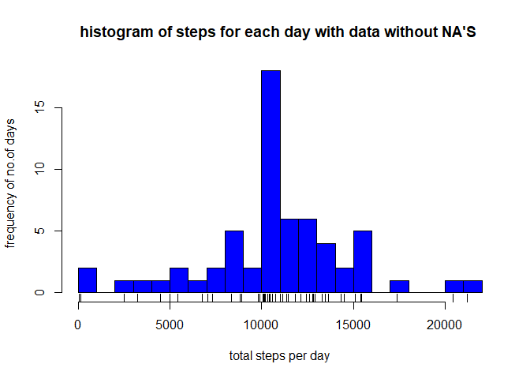
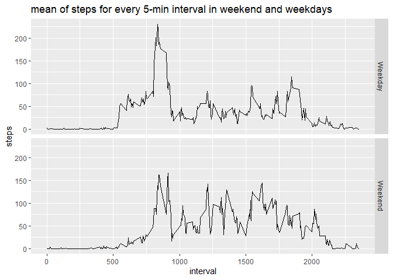

# reproducible researc: week-2 assignment

## 1 loading the data
This assignment makes use of data from a personal activity monitoring device. This device collects data at 5 minute intervals through out the day. The data consists of two months of data from an anonymous individual collected during the months of October and November, 2012 and include the number of steps taken in 5 minute intervals each day.   
This dataset can be downloaded from:[activity dataset](https://d396qusza40orc.cloudfront.net/repdata%2Fdata%2Factivity.zip)  

### 1.1 loading the activity data

```r
activity_data<-read.csv("activity.csv",header = TRUE)
tail(activity_data)
```

```
##       steps       date interval
## 17563    NA 2012-11-30     2330
## 17564    NA 2012-11-30     2335
## 17565    NA 2012-11-30     2340
## 17566    NA 2012-11-30     2345
## 17567    NA 2012-11-30     2350
## 17568    NA 2012-11-30     2355
```

## 2 What is mean total number of steps taken per day?

### 2.1 caliculating the total number of steps taken per day

```r
#extracting numerical data(data without NA's)
num_data_steps<-activity_data[grep("^[0-9]",activity_data$steps),]
head(num_data_steps)
```

```
##     steps       date interval
## 289     0 2012-10-02        0
## 290     0 2012-10-02        5
## 291     0 2012-10-02       10
## 292     0 2012-10-02       15
## 293     0 2012-10-02       20
## 294     0 2012-10-02       25
```

```r
#caliculating total number of steps per day
sum_data_steps<-tapply(num_data_steps$steps,num_data_steps$date, sum)
sum_data_steps
```

```
## 2012-10-02 2012-10-03 2012-10-04 2012-10-05 2012-10-06 2012-10-07 2012-10-09 
##        126      11352      12116      13294      15420      11015      12811 
## 2012-10-10 2012-10-11 2012-10-12 2012-10-13 2012-10-14 2012-10-15 2012-10-16 
##       9900      10304      17382      12426      15098      10139      15084 
## 2012-10-17 2012-10-18 2012-10-19 2012-10-20 2012-10-21 2012-10-22 2012-10-23 
##      13452      10056      11829      10395       8821      13460       8918 
## 2012-10-24 2012-10-25 2012-10-26 2012-10-27 2012-10-28 2012-10-29 2012-10-30 
##       8355       2492       6778      10119      11458       5018       9819 
## 2012-10-31 2012-11-02 2012-11-03 2012-11-05 2012-11-06 2012-11-07 2012-11-08 
##      15414      10600      10571      10439       8334      12883       3219 
## 2012-11-11 2012-11-12 2012-11-13 2012-11-15 2012-11-16 2012-11-17 2012-11-18 
##      12608      10765       7336         41       5441      14339      15110 
## 2012-11-19 2012-11-20 2012-11-21 2012-11-22 2012-11-23 2012-11-24 2012-11-25 
##       8841       4472      12787      20427      21194      14478      11834 
## 2012-11-26 2012-11-27 2012-11-28 2012-11-29 
##      11162      13646      10183       7047
```

```r
#creating a dataframe with dates, no.of steps on that day
day_wise_data<-data.frame(date=unique(num_data_steps$date),steps=sum_data_steps)
head(day_wise_data)
```

```
##                  date steps
## 2012-10-02 2012-10-02   126
## 2012-10-03 2012-10-03 11352
## 2012-10-04 2012-10-04 12116
## 2012-10-05 2012-10-05 13294
## 2012-10-06 2012-10-06 15420
## 2012-10-07 2012-10-07 11015
```

### 2.2 histogram of the total number of steps taken each day

```r
hist(day_wise_data$steps,xlab = "total steps per day",ylab="frequency of no.of days ",main = "histogram of steps for each day",breaks = 20,col = "red")
rug(day_wise_data$steps)
```

<!-- -->

### 2.3 mean and median of the total number of steps taken per day

```r
mean_data<-mean(sum_data_steps)
mean_data
```

```
## [1] 10766.19
```

```r
median_data<-median(day_wise_data$steps)
median_data
```

```
## [1] 10765
```

## 3 What is the average daily activity pattern?

### 3.1 A time series plot of the 5-minute interval (x-axis) and the average number of steps taken, averaged across all days (y-axis)

```r
interval_steps_sum<-aggregate(num_data_steps$steps,by=list(num_data_steps$interval),mean)
colnames(interval_steps_sum)<-c("interval","steps")
plot(interval_steps_sum$interval,interval_steps_sum$steps,type="l",ylab = "no.of steps taken",xlab="intarval",main="average number of steps for every 5-minute interval")
```

<!-- -->

### 3.2 finding Which 5-minute interval, on average across all the days in the dataset, contains the maximum number of steps

```r
interval_steps_sum[max(interval_steps_sum$steps)==interval_steps_sum$steps,]
```

```
##     interval    steps
## 104      835 206.1698
```

## 4 Imputing missing values

### 4.1 finding number of missing values in the dataset

```r
number_of_missing_values<-sum(is.na(activity_data))
number_of_missing_values
```

```
## [1] 2304
```

### 4.2 Devising a strategy for filling in all of the missing values in the dataset by using the mean value of the interval.

```r
#extracting the the rows with missingvalues into a different dataframe
missing_data<-activity_data[is.na(activity_data),]
#filling NA's with mean value of interval associated with that row
missing_data$steps<-ifelse(missing_data$interval==interval_steps_sum$interval,as.integer(interval_steps_sum$steps))
head(missing_data)
```

```
##   steps       date interval
## 1     1 2012-10-01        0
## 2     0 2012-10-01        5
## 3     0 2012-10-01       10
## 4     0 2012-10-01       15
## 5     0 2012-10-01       20
## 6     2 2012-10-01       25
```

### 4.3 Creating a new dataset that is equal to the original dataset but with the missing data filled in.

```r
activity_data_without_NA<-rbind(num_data_steps,missing_data)
head(activity_data_without_NA)
```

```
##     steps       date interval
## 289     0 2012-10-02        0
## 290     0 2012-10-02        5
## 291     0 2012-10-02       10
## 292     0 2012-10-02       15
## 293     0 2012-10-02       20
## 294     0 2012-10-02       25
```

```r
#confirming that there are no missing values in the data
sum(is.na(activity_data_without_NA))
```

```
## [1] 0
```

### 4.4  histogram of the total number of steps taken each day

```r
sum_data_steps_without_na<-tapply(activity_data_without_NA$steps,activity_data_without_NA$date,sum)
hist(sum_data_steps_without_na,xlab = "total steps per day",ylab="frequency of no.of days ",main = "histogram of steps for each day with data without NA'S ",breaks = 20,col = "blue")
rug(day_wise_data$steps)
```

<!-- -->

### 4.5 mean and median of the total number of steps taken per day after filling out the missing values

```r
sprintf("mean of data with NA's in it: %i",as.integer(mean(sum_data_steps)))
```

```
## [1] "mean of data with NA's in it: 10766"
```

```r
sprintf("median of data with NA's in it: %i",as.integer(median(sum_data_steps)))
```

```
## [1] "median of data with NA's in it: 10765"
```

```r
sprintf("mean of data with no missing values(all missing values imputed): %i",as.integer(mean(sum_data_steps_without_na)))
```

```
## [1] "mean of data with no missing values(all missing values imputed): 10749"
```

```r
sprintf("median of data with no missing values(all missing values imputed): %i",as.integer(median(sum_data_steps_without_na)))
```

```
## [1] "median of data with no missing values(all missing values imputed): 10641"
```

It is can be understood that the mean and median of the data with imputed missing values has lower values when compared to the mean and median values of data with NA's in it. We can further use any other imputation methods to study the trends and effects of missing values imputations on the data. 

## 5 Are there differences in activity patterns between weekdays and weekends?

### 5.1 Creating a new factor variable in the dataset with two levels – “weekday” and “weekend” indicating whether a given date is a weekday or weekend day.

```r
activity_data_without_NA$dayofweek <- weekdays(as.Date(activity_data_without_NA$date))
activity_data_without_NA$weekend <-as.factor(activity_data_without_NA$dayofweek=="Saturday"|activity_data_without_NA$dayofweek=="Sunday")
levels(activity_data_without_NA$weekend) <- c("Weekday", "Weekend")
```

### 5.2 Making a panel plot containing a time series plot of the 5-minute interval (x-axis) and the average number of steps taken, averaged across all weekday days or weekend days (y-axis)

```r
activity_data_weekday<-activity_data_without_NA[activity_data_without_NA$weekend=="Weekday",]
head(activity_data_weekday)
```

```
##     steps       date interval dayofweek weekend
## 289     0 2012-10-02        0   Tuesday Weekday
## 290     0 2012-10-02        5   Tuesday Weekday
## 291     0 2012-10-02       10   Tuesday Weekday
## 292     0 2012-10-02       15   Tuesday Weekday
## 293     0 2012-10-02       20   Tuesday Weekday
## 294     0 2012-10-02       25   Tuesday Weekday
```

```r
activity_data_weekend<-activity_data_without_NA[activity_data_without_NA$weekend=="Weekend",]
head(activity_data_weekend)
```

```
##      steps       date interval dayofweek weekend
## 1441     0 2012-10-06        0  Saturday Weekend
## 1442     0 2012-10-06        5  Saturday Weekend
## 1443     0 2012-10-06       10  Saturday Weekend
## 1444     0 2012-10-06       15  Saturday Weekend
## 1445     0 2012-10-06       20  Saturday Weekend
## 1446     0 2012-10-06       25  Saturday Weekend
```

```r
interval_steps_sum_weekday<-aggregate(activity_data_weekday$steps,by=list(activity_data_weekday$interval),mean)
interval_steps_sum_weekday$weekend<-rep("Weekday",length(interval_steps_sum_weekday))
head(interval_steps_sum_weekday)
```

```
##   Group.1          x weekend
## 1       0 2.15555556 Weekday
## 2       5 0.40000000 Weekday
## 3      10 0.15555556 Weekday
## 4      15 0.17777778 Weekday
## 5      20 0.08888889 Weekday
## 6      25 1.57777778 Weekday
```

```r
interval_steps_sum_weekend<-aggregate(activity_data_weekend$steps,by=list(activity_data_weekend$interval),mean)
interval_steps_sum_weekend$weekend<-rep("Weekend",length(interval_steps_sum_weekend))
interval_steps_sum_merged<-rbind(interval_steps_sum_weekday,interval_steps_sum_weekend)
colnames(interval_steps_sum_merged)<-c("interval","steps","weekend")
#final plot
library(ggplot2)
```

```
## Warning: package 'ggplot2' was built under R version 4.0.2
```

```r
ggplot(interval_steps_sum_merged,aes(x = interval,y=steps))+geom_line()+facet_grid(weekend~.)+ggtitle("mean of steps for every 5-min interval in weekend and weekdays")
```

<!-- -->
